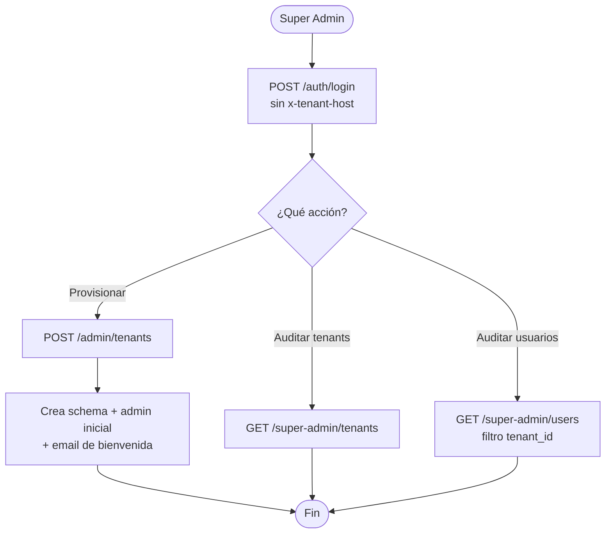
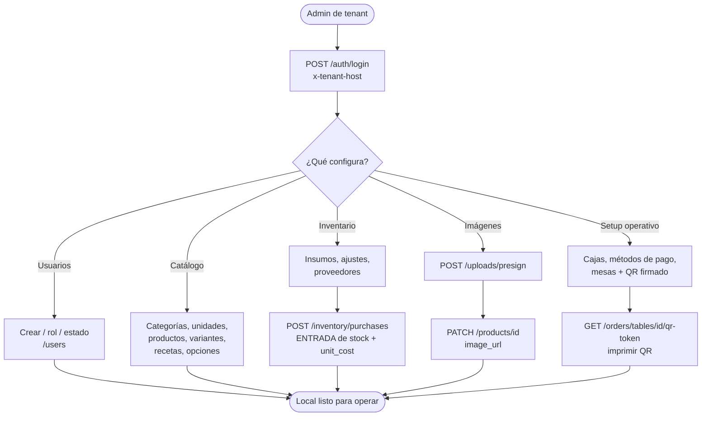
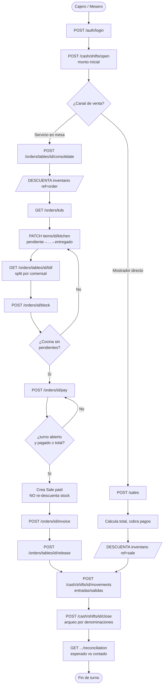
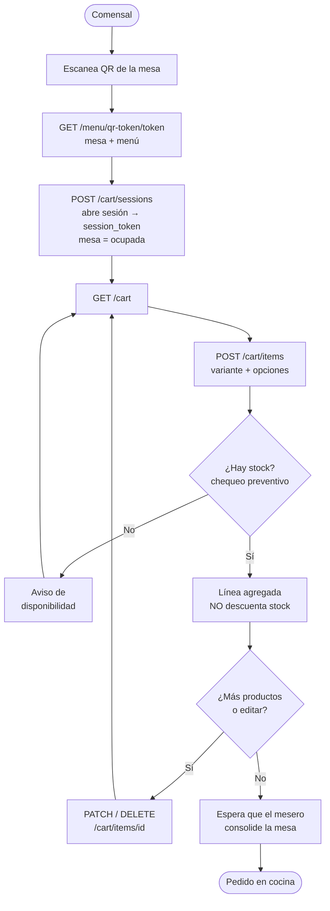

# Funcionalidades implementadas — POS Multi-tenant (heladería)

> Documento de **requerimientos que ya se pueden realizar** hoy en el backend, más los
> **diagramas de flujo por rol**. Todo lo listado corresponde a endpoints reales bajo el
> prefijo global `/api/v1`. Última actualización: 2026-07-18.

---

## 1. Introducción y actores

El sistema es un **POS multi-tenant** con aislamiento **schema-per-tenant** en PostgreSQL. Cada
petición identifica su tenant por el header `x-tenant-host` (staff) o por un **token firmado**
embebido (flujo público del comensal por QR). La identidad (`users`, `roles`, `tenants`) vive en el
schema `shared`; los datos operativos viven en el schema del tenant.

### Actores

| Rol | Autenticación | Alcance |
|---|---|---|
| **Super Admin** (global, `tenant_id = NULL`) | JWT global (`get_current_super_admin`), sin `x-tenant-host` | Provisiona tenants y su admin inicial; visión global de usuarios y tenants |
| **Admin de tenant** (`role = ADMIN`) | JWT de tenant + `x-tenant-host` (`require_tenant_admin`) | Configuración: usuarios, catálogo, inventario, proveedores/compras, cajas, mesas, métodos de pago, imágenes |
| **Cajero / Mesero** (`role = CASHIER` o `ADMIN`) | JWT de tenant + `x-tenant-host` (`get_current_user`) | Operación diaria: caja, ventas, mesas, cocina/KDS, cobro y facturación |
| **Comensal (QR, anónimo)** | Token QR firmado + token de sesión (`x-session-token`) | Menú público, sesión de mesa y carrito, sin cuenta de usuario |

> **Nota:** `require_tenant_admin` incluye todo lo de `get_current_user` (un ADMIN también opera).
> Las lecturas de catálogo/inventario suelen pedir solo `get_current_user`; la **configuración**
> (crear/editar) suele pedir `require_tenant_admin`. Excepción: `categories` y `unit-measures`
> permiten escritura a cualquier usuario autenticado del tenant.

---

## 2. Requisitos Funcionales (RF) por módulo

Columnas: **ID · Actor · Requerimiento · Endpoint**.

### 2.1 Autenticación
| ID | Actor | Requerimiento | Endpoint |
|---|---|---|---|
| RF-AUTH-01 | Todos | Iniciar sesión resolviendo el tenant por `x-tenant-host` (o super admin global si no hay host) | `POST /auth/login` |
| RF-AUTH-02 | Usuario autenticado | Cambiar la propia contraseña (limpia `must_change_password`) | `POST /auth/change-password` |
| RF-AUTH-03 | Usuario autenticado | Renovar el access token con un refresh token válido | `GET /auth/refresh-token` |
| RF-AUTH-04 | Usuario autenticado | Cerrar sesión revocando el token (blocklist en Redis) | `GET /auth/logout` |

### 2.2 Administración global (Super Admin)
| ID | Actor | Requerimiento | Endpoint |
|---|---|---|---|
| RF-SA-01 | Super Admin | Crear un tenant (schema + admin inicial con clave aleatoria + email de bienvenida) | `POST /admin/tenants` |
| RF-SA-02 | Super Admin | Listar todos los usuarios del sistema (filtro por `tenant_id`) | `GET /super-admin/users` |
| RF-SA-03 | Super Admin | Listar todos los tenants registrados | `GET /super-admin/tenants` |

### 2.3 Gestión de usuarios del tenant
| ID | Actor | Requerimiento | Endpoint |
|---|---|---|---|
| RF-USR-01 | Admin | Listar los usuarios del tenant | `GET /users` |
| RF-USR-02 | Admin | Crear usuario (ADMIN o CASHIER; email único por tenant) | `POST /users` |
| RF-USR-03 | Admin | Consultar detalle de un usuario | `GET /users/{id}` |
| RF-USR-04 | Admin | Cambiar el rol de un usuario (no el propio) | `PATCH /users/{id}/role` |
| RF-USR-05 | Admin | Activar/desactivar un usuario (no a sí mismo) | `PATCH /users/{id}/status` |

### 2.4 Catálogo
| ID | Actor | Requerimiento | Endpoint |
|---|---|---|---|
| RF-CAT-01 | Autenticado | Listar / consultar categorías (filtro `active`) | `GET /categories`, `GET /categories/{id}` |
| RF-CAT-02 | Autenticado | Crear / editar / desactivar categoría (soft-delete) | `POST/PATCH/DELETE /categories/{...}` |
| RF-CAT-03 | Autenticado | Listar / consultar unidades de medida | `GET /unit-measures`, `GET /unit-measures/{id}` |
| RF-CAT-04 | Autenticado | Crear / editar / desactivar unidad de medida (abreviatura única) | `POST/PATCH/DELETE /unit-measures/{...}` |
| RF-CAT-05 | Autenticado | Listar / consultar productos (paginado, filtro `active`) | `GET /products`, `GET /products/{id}` |
| RF-CAT-06 | Admin | Crear producto (SIMPLE genera variante default automática) | `POST /products` |
| RF-CAT-07 | Admin | Editar / desactivar producto | `PATCH/PUT/DELETE /products/{id}` |
| RF-CAT-08 | Autenticado | Listar variantes de un producto | `GET /products/{id}/variants` |
| RF-CAT-09 | Admin | Crear / editar / desactivar variante (SKU autogenerado si falta) | `POST /products/{id}/variants`, `PATCH/DELETE /variants/{id}` |
| RF-CAT-10 | Autenticado / Admin | Ver / definir la receta (BOM) de una variante | `GET/PUT /variants/{id}/recipe` |
| RF-CAT-11 | Autenticado / Admin | Listar / crear grupos de opciones y sus opciones (con precio extra e insumo) | `GET/POST /option-groups`, `POST /option-groups/{id}/options` |
| RF-CAT-12 | Admin | Asignar un grupo de opciones a un producto (min/max propios) | `POST /products/{id}/option-groups` |

### 2.5 Inventario
| ID | Actor | Requerimiento | Endpoint |
|---|---|---|---|
| RF-INV-01 | Autenticado | Listar insumos y detalle (filtro `active`) | `GET /inventory/items`, `GET /inventory/items/{id}` |
| RF-INV-02 | Autenticado | Ver insumos en o bajo el mínimo (alertas de reposición) | `GET /inventory/items/low-stock` |
| RF-INV-03 | Admin | Crear / editar insumo (valida unidad, nombre único) | `POST/PATCH /inventory/items/{...}` |
| RF-INV-04 | Admin | Ajustar stock manualmente (delta con signo + motivo, registra kardex) | `POST /inventory/items/{id}/adjust` |
| RF-INV-05 | Autenticado | Consultar el kardex (movimientos) de un insumo | `GET /inventory/items/{id}/movements` |
| RF-INV-06 | Autenticado / Admin | Listar / crear / editar proveedores | `GET/POST /inventory/suppliers`, `PATCH /inventory/suppliers/{id}` |
| RF-INV-07 | Admin | Registrar compra que da alta de stock y actualiza `unit_cost` | `POST /inventory/purchases` |
| RF-INV-08 | Autenticado | Listar compras | `GET /inventory/purchases` |

### 2.6 Menú público / QR
| ID | Actor | Requerimiento | Endpoint |
|---|---|---|---|
| RF-MENU-01 | Comensal / Público | Ver el menú activo por `x-tenant-host` | `GET /menu` |
| RF-MENU-02 | Comensal | Ver mesa + menú por token QR firmado (no expone `table_id`) | `GET /menu/qr-token/{token}` |
| RF-MENU-03 | Comensal | (Legacy) Ver mesa + menú por `qr_token` UUID | `GET /menu/qr/{qr_token}` |

### 2.7 Carrito del comensal
| ID | Actor | Requerimiento | Endpoint |
|---|---|---|---|
| RF-CART-01 | Comensal | Abrir sesión de mesa desde el QR firmado y recibir `session_token` (marca mesa ocupada) | `POST /cart/sessions` |
| RF-CART-02 | Comensal | Ver el carrito de la sesión | `GET /cart` |
| RF-CART-03 | Comensal | Agregar línea (variante + opciones; chequeo preventivo de stock, sin reserva) | `POST /cart/items` |
| RF-CART-04 | Comensal | Editar / quitar línea del carrito | `PATCH/DELETE /cart/items/{id}` |

### 2.8 Órdenes / mesas
| ID | Actor | Requerimiento | Endpoint |
|---|---|---|---|
| RF-ORD-01 | Autenticado | Listar mesas | `GET /orders/tables` |
| RF-ORD-02 | Admin | Crear / editar mesa (genera `qr_token`, número único) | `POST /orders/tables`, `PATCH /orders/tables/{id}` |
| RF-ORD-03 | Admin | Emitir el token QR firmado imprimible de la mesa (+ `menu_path`) | `GET /orders/tables/{id}/qr-token` |
| RF-ORD-04 | Cajero/Mesero | Cerrar una sesión de mesa | `POST /orders/sessions/{id}/close` |
| RF-ORD-05 | Cajero/Mesero | Consolidar los carritos de la mesa en la orden abierta (**descuenta inventario**) | `POST /orders/tables/{id}/consolidate` |
| RF-ORD-06 | Cajero/Mesero | Agregar un ítem directo a la orden de la mesa | `POST /orders/tables/{id}/items` |
| RF-ORD-07 | Cajero/Mesero | Ver el tablero de cocina (KDS) agrupado por mesa/orden | `GET /orders/kds` |
| RF-ORD-08 | Cajero/Mesero | Avanzar estado de cocina (pendiente→en_preparación→listo→entregado) | `PATCH /orders/items/{id}/kitchen` |
| RF-ORD-09 | Cajero/Mesero | Anular / reemplazar un ítem (revierte inventario si no se preparó) | `POST /orders/items/{id}/void` |
| RF-ORD-10 | Cajero/Mesero | Ver la cuenta de la mesa con **split por comensal** | `GET /orders/tables/{id}/bill` |
| RF-ORD-11 | Cajero/Mesero | Bloquear la orden para cobro (lock optimista, valida cocina sin pendientes) | `POST /orders/{id}/block` |
| RF-ORD-12 | Cajero/Mesero | Cobrar la orden bloqueada (crea venta; exige turno de caja abierto) | `POST /orders/{id}/pay` |
| RF-ORD-13 | Cajero/Mesero | Cancelar la orden (**revierte inventario** + auditoría) | `POST /orders/{id}/cancel` |
| RF-ORD-14 | Cajero/Mesero | Liberar la mesa (regla dura: sin órdenes activas) | `POST /orders/tables/{id}/release` |
| RF-ORD-15 | Público | Crear comanda directa (mostrador/QR, sin usuario, no descuenta stock) | `POST /orders` |
| RF-ORD-16 | Cajero/Mesero | Listar / consultar / cambiar estado de comandas | `GET /orders`, `GET /orders/{id}`, `PATCH /orders/{id}/status` |

### 2.9 Caja
| ID | Actor | Requerimiento | Endpoint |
|---|---|---|---|
| RF-CASH-01 | Autenticado / Admin | Listar cajas / crear caja (nombre único) | `GET/POST /cash/registers` |
| RF-CASH-02 | Cajero | Abrir turno con monto inicial (una por caja; 409 si ya hay uno abierto) | `POST /cash/shifts/open` |
| RF-CASH-03 | Cajero | Registrar **ingreso/egreso/retiro** con **categoría** en el turno abierto | `POST /cash/shifts/{id}/movements` |
| RF-CASH-04 | Cajero | Cerrar turno con arqueo (monto contado y/o desglose por denominaciones) | `POST /cash/shifts/{id}/close` |
| RF-CASH-05 | Cajero | Ver la reconciliación del turno (esperado vs contado + diferencia) | `GET /cash/shifts/{id}/reconciliation` |
| RF-CASH-06 | Cajero | Reconciliación con **ventas desglosadas por método** (efectivo/tarjeta/transferencia) | `GET /cash/shifts/{id}/reconciliation` |
| RF-CASH-07 | Cajero | **Listar movimientos** del turno (tabla / línea de tiempo) | `GET /cash/shifts/{id}/movements` |
| RF-CASH-08 | Cajero | Cierre exige **observación** (`close_note`) si el arqueo **no cuadra** | `POST /cash/shifts/{id}/close` |
| RF-CASH-09 | Cajero | **Reporte de cierre** consolidado del turno | `GET /cash/shifts/{id}/report` |
| RF-CASH-10 | Cajero | Consultar el **turno abierto actual** de una caja | `GET /cash/shifts/current` |

### 2.10 Ventas (checkout directo)
| ID | Actor | Requerimiento | Endpoint |
|---|---|---|---|
| RF-SALE-01 | Autenticado / Admin | Listar métodos de pago / crear método (flag `is_cash`) | `GET/POST /sales/payment-methods` |
| RF-SALE-02 | Cajero | Registrar venta de mostrador (calcula total, cobra y **descuenta inventario**) | `POST /sales` |
| RF-SALE-03 | Cajero | Listar / consultar ventas con ítems y pagos | `GET /sales`, `GET /sales/{id}` |

### 2.11 Facturación
| ID | Actor | Requerimiento | Endpoint |
|---|---|---|---|
| RF-FAC-01 | Cajero/Mesero | Generar factura de una orden pagada (idempotente, consecutivo con lock) | `POST /orders/{id}/invoice` |
| RF-FAC-02 | Cajero/Mesero | Facturar todas las órdenes pagadas de una mesa (cierre de mesa) | `POST /orders/tables/{id}/invoice-all` |
| RF-FAC-03 | Cajero/Mesero | Consultar / listar facturas (filtros `table_id`, `order_id`) | `GET /invoices/{id}`, `GET /invoices` |

### 2.12 Infraestructura
| ID | Actor | Requerimiento | Endpoint |
|---|---|---|---|
| RF-INF-01 | Admin | Obtener URL firmada (presign) para subir imagen de producto a R2 | `POST /uploads/presign` |
| RF-INF-02 | Público | Healthcheck del servicio | `GET /health` |

---

## 3. Historias de usuario por rol

### 3.1 Super Admin
- Como **super admin** quiero **crear un tenant nuevo** con su admin y schema aislado para dar de alta un cliente (RF-SA-01).
- Como **super admin** quiero **listar todos los tenants y usuarios** del sistema para tener visibilidad global (RF-SA-02, RF-SA-03).

### 3.2 Admin de tenant
- Como **admin** quiero **gestionar los usuarios** de mi negocio (crear cajeros, cambiar roles/estado) para controlar los accesos (RF-USR-01…05).
- Como **admin** quiero **configurar el catálogo** (categorías, unidades, productos, variantes, recetas y opciones) para definir qué se vende (RF-CAT-01…12).
- Como **admin** quiero **administrar el inventario** (insumos, ajustes, proveedores, compras) para controlar el stock y los costos (RF-INV-01…08).
- Como **admin** quiero **crear cajas, mesas (con su QR) y métodos de pago** para dejar el local listo para operar (RF-CASH-01, RF-ORD-02/03, RF-SALE-01).
- Como **admin** quiero **subir imágenes de producto** de forma segura para enriquecer el menú (RF-INF-01).

### 3.3 Cajero / Mesero
- Como **cajero** quiero **abrir mi turno de caja** con un monto inicial para empezar a cobrar con control de efectivo (RF-CASH-02).
- Como **mesero** quiero **consolidar los carritos de la mesa** en una orden para enviarla a cocina descontando insumos (RF-ORD-05).
- Como **cocina/mesero** quiero **ver el KDS y avanzar el estado** de cada ítem para coordinar la preparación (RF-ORD-07/08), y **anular** un ítem devolviendo insumos si no se preparó (RF-ORD-09).
- Como **cajero** quiero **ver la cuenta con split por comensal, bloquear y cobrar** la orden para cerrar la mesa correctamente (RF-ORD-10/11/12).
- Como **cajero** quiero **registrar ventas de mostrador** rápidas que descuenten stock (RF-SALE-02).
- Como **cajero** quiero **registrar movimientos de efectivo, cerrar el turno con arqueo y ver la reconciliación** para cuadrar la caja (RF-CASH-03/04/05).
- Como **cajero** quiero **generar las facturas** de las órdenes pagadas para entregar el comprobante (RF-FAC-01/02/03).

### 3.4 Comensal (QR)
- Como **comensal** quiero **escanear el QR de la mesa y ver el menú** sin instalar nada ni registrarme (RF-MENU-02).
- Como **comensal** quiero **abrir una sesión y armar mi carrito** (agregar, editar, quitar líneas con opciones) para hacer mi pedido (RF-CART-01…04).
- Como **comensal** quiero que el sistema **avise si un producto no tiene stock** antes de pedirlo para no llevarme sorpresas (chequeo preventivo en RF-CART-03).

---

## 4. Diagramas de flujo por rol

> Reglas de negocio reflejadas en los diagramas:
> el inventario se descuenta **al consolidar** (mesa) o **al pagar** (venta directa), nunca dos veces;
> el cobro de orden exige orden **bloqueada** + **turno de caja abierto** + cocina sin pendientes;
> el comensal **no** descuenta stock (solo chequeo best-effort).

### 4.1 Super Admin

### 4.2 Admin de tenant

### 4.3 Cajero / Mesero

### 4.4 Comensal (QR)

---

_Documento generado a partir del análisis de los routers en `app/api/v1/` y las dependencias de
`app/core/dependencies.py` / `app/core/qr_context.py`. Todos los endpoints llevan el prefijo `/api/v1`._
