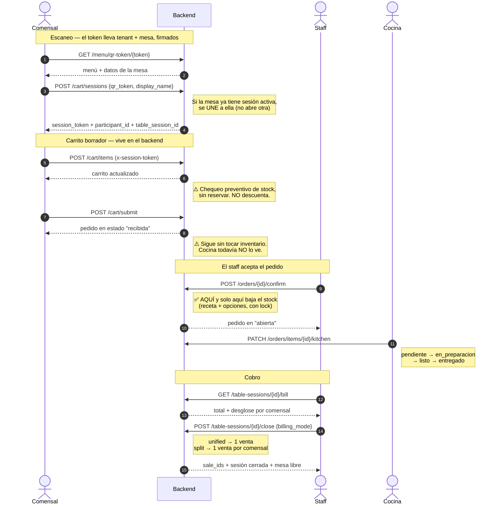
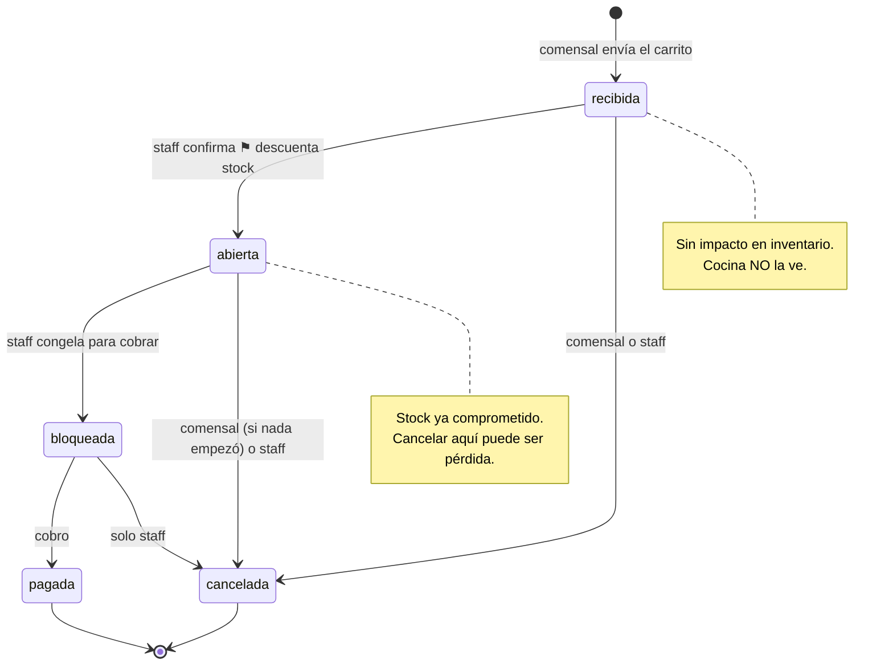
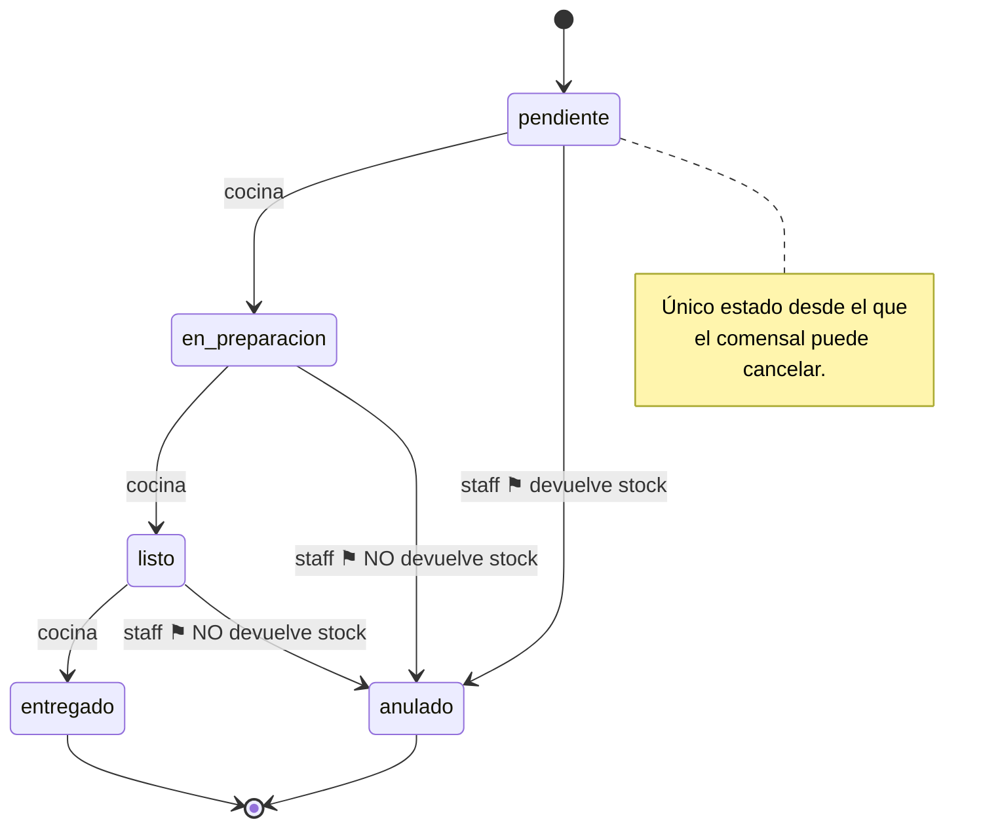
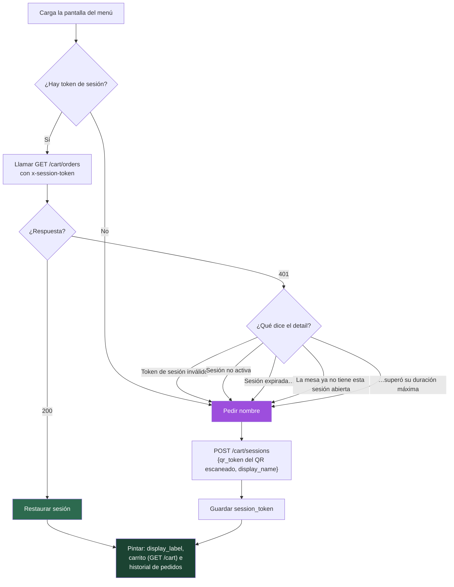
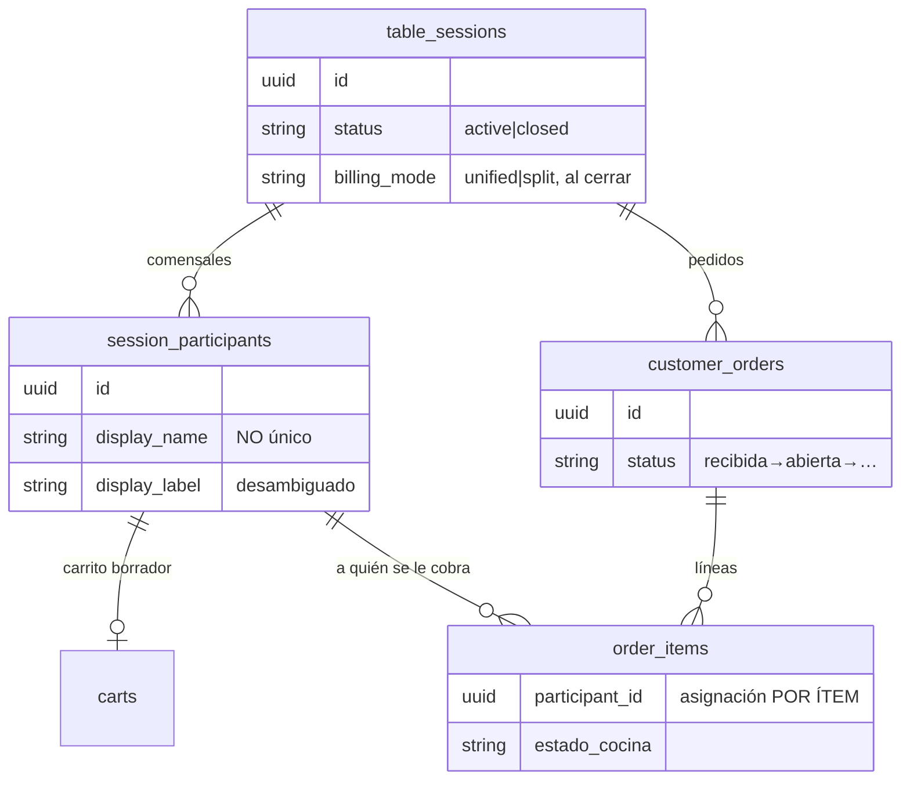

# Flujo de pedidos por QR — guía para el frontend

Contrato del backend para construir la UI del comensal y las pantallas de staff, sin
necesidad de leer el código. Todo lo descrito aquí está verificado end-to-end en
[`app/scripts/e2e_qr_flow.py`](../app/scripts/e2e_qr_flow.py).

**Las dos reglas que más se asumen mal:**

1. **Llenar el carrito y enviar el pedido NO descuentan inventario.** El stock solo
   se compromete cuando el staff confirma el pedido. Hasta ese momento el comensal
   puede cancelar sin ningún coste.
2. **`display_name` no identifica a nadie.** Es solo un texto que el comensal escribe;
   no es único. El identificador real viaja firmado dentro del token de sesión.

---

## 1. Camino feliz, de principio a fin



---

## 2. Estados: dos ejes independientes

El pedido y la cocina avanzan por separado. La UI necesita **los dos** para decidir
qué botones habilitar.

### Estado del pedido (`customer_orders.status`)



### Estado de cocina (`order_items.estado_cocina`, por ítem)



> **Solo avanza hacia adelante.** Saltarse un paso o retroceder devuelve `409`.

---

## 3. Qué hacer al cargar el menú (árbol de decisión)

El diagrama que más va a usar el front: decide qué pantalla mostrar.



**Todas las ramas de `401` terminan igual: descartar el token y pedir el nombre.** No
hace falta distinguirlas para la lógica; sirven para el mensaje que se muestra.

**Persistencia del token**, por orden de lectura:

1. **query param** del enlace (`?s=<token>`) — gana, para que abrir el enlace
   compartido en otro dispositivo reingrese a esa sesión;
2. **`localStorage`** (`pos.diner.session_token`) — almacén principal entre recargas.

> Una versión anterior de este documento recomendaba una cookie `httpOnly` +
> `Secure` como almacén principal. **No es implementable con el contrato actual**:
> `POST /cart/sessions` devuelve el token en el cuerpo JSON, no con `Set-Cookie`,
> y una cookie httpOnly no se puede escribir desde JavaScript por definición.
> Para tenerla, el backend tendría que emitirla.

**Mesa equivocada**: si el comensal escanea el QR de la mesa 5 con un token de la
mesa 3, el backend responde `401` y hay que abrir participante nuevo **en la mesa
escaneada**. Nunca reutilizar el `table_session_id` de un token inválido.

---

## 4. Endpoints

### Público — comensal (sin login)

| Método | Ruta | Auth | Cuándo |
|---|---|---|---|
| `GET` | `/api/v1/menu/qr-token/{token}` | token en la URL | al escanear: menú + mesa |
| `POST` | `/api/v1/cart/sessions` | `qr_token` en el body | unirse a la mesa |
| `GET` | `/api/v1/cart` | `x-session-token` | ver carrito |
| `POST` | `/api/v1/cart/items` | `x-session-token` | añadir línea |
| `PATCH` | `/api/v1/cart/items/{item_id}` | `x-session-token` | editar cantidad/opciones |
| `DELETE` | `/api/v1/cart/items/{item_id}` | `x-session-token` | quitar línea |
| `POST` | `/api/v1/cart/submit` | `x-session-token` | enviar el pedido |
| `GET` | `/api/v1/cart/orders` | `x-session-token` | historial propio |
| `POST` | `/api/v1/cart/orders/{order_id}/cancel` | `x-session-token` | cancelar pedido propio |

### Staff (`Authorization: Bearer` + `x-tenant-host`)

| Método | Ruta | Cuándo |
|---|---|---|
| `GET` | `/api/v1/orders/tables/{table_id}/qr-token` | generar el QR imprimible (solo admin) |
| `POST` | `/api/v1/orders/{order_id}/confirm` | aceptar pedido ⚑ descuenta stock |
| `GET` | `/api/v1/orders/kds` | pantalla de cocina |
| `PATCH` | `/api/v1/orders/items/{item_id}/kitchen` | avanzar estado de cocina |
| `POST` | `/api/v1/orders/items/{item_id}/void` | anular/reemplazar un ítem |
| `POST` | `/api/v1/orders/{order_id}/cancel` | cancelar pedido (sin límite de estado) |
| `GET` | `/api/v1/table-sessions` | mesas con sesión abierta |
| `GET` | `/api/v1/table-sessions/{id}` | detalle + comensales |
| `GET` | `/api/v1/table-sessions/{id}/bill` | cuenta con desglose |
| `POST` | `/api/v1/table-sessions/{id}/close` | cobrar y liberar la mesa |

### Respuestas clave

`POST /cart/sessions` →

```json
{
  "participant_id": "uuid",
  "table_session_id": "uuid",
  "display_name": "Ana",
  "display_label": "Ana (2)",
  "expires_at": "2026-07-28T02:00:00",
  "table": { "id": "uuid", "number": 5, "name": "Terraza 1" },
  "cart_id": "uuid",
  "session_token": "eyJhbGci..."
}
```

> Mostrar siempre **`display_label`**, no `display_name`: es el nombre ya
> desambiguado que ven también cocina y staff.

`GET /cart` → el carrito abierto (`id`, `status`, `total`, `items[]`) **más
`display_name` y `display_label` del comensal dueño**.

> El nombre viaja aquí porque el `session_token` no lo lleva: al recargar el menú esta
> es la vía para repintar el saludo (el paso "Restaurar sesión" del árbol de decisión de
> arriba). El front no necesita guardar el nombre en el navegador.

`GET /cart/orders` → lista de pedidos, cada uno con `status`, `created_at` e `items[]`
con su `estado_cocina`. **Es la fuente para pintar el progreso** (por polling; no hay
websockets ni push).

---

## 5. Por qué el split es exacto



La asignación al comensal está en **`order_items.participant_id`**, no en el pedido.
Por eso la cuenta dividida es exacta aunque un pedido mezcle personas.

---

## 6. Errores: qué hacer en la UI

| Código | Dónde | Causa | Acción en la UI |
|---|---|---|---|
| `401` | cualquier ruta con `x-session-token` | token inválido / sesión cerrada / mesa distinta / TTL agotado | descartar token y pedir nombre (§3) |
| `401` | `/menu/qr-token/{token}` | QR manipulado o mal copiado | pantalla de "QR no válido, pide ayuda al personal" |
| `409` | `POST /cart/items` | stock insuficiente (preventivo) | **detalle estructurado**, ver abajo |
| `409` | `POST /cart/submit` | carrito vacío | deshabilitar el botón antes; no llegar aquí |
| `409` | `POST /cart/orders/{id}/cancel` | cocina ya empezó | ocultar el botón según `estado_cocina`; no depender del error |
| `404` | `POST /cart/orders/{id}/cancel` | el pedido no es de este comensal | no debería ocurrir con UI correcta |
| `422` | `POST /cart/items` | variante inactiva | refrescar el menú |
| `422` | cualquier ruta con `x-session-token` | **falta la cabecera** | error de integración, no de usuario |
| `429` | rutas públicas | rate limit | respetar `Retry-After` (segundos) y reintentar |
| `400` | `POST /orders/{id}/confirm` (staff) | stock insuficiente real | **mensaje plano**, ver abajo |
| `409` | `POST /orders/{id}/confirm` (staff) | el pedido ya no está en `recibida` | refrescar la lista |
| `409` | `PATCH /orders/items/{id}/kitchen` | transición inválida | detalle con `desde`/`hacia` |
| `422` | `POST /table-sessions/{id}/close` (staff) | faltan comensales en el split | listar los `participant_ids` que devuelve |

> **Un `400` al confirmar no rompe nada**: el pedido **sigue en `recibida`**, así que
> el staff puede reponer stock y reintentar, o cancelarlo. Verificado.

### Los dos formatos de "no hay stock"

No son intercambiables. En el **carrito** el detalle es un objeto:

```json
{ "detail": {
    "error": "Stock insuficiente",
    "insumo": "Leche entera",
    "disponible": "2.000",
    "requerido": "5.000",
    "contexto": "carrito"
}}
```

En la **confirmación del staff** es una cadena:

```json
{ "detail": "Stock insuficiente de 'Leche entera': disponible 2.000, requerido 5.000." }
```

El primero permite señalar el ingrediente concreto en la UI; el segundo se muestra
tal cual.

### Rate limiting

Por IP y por mesa, ventana de 60 s (`60` peticiones/IP, `120`/mesa por defecto). Se
aplica **antes** de validar el token, así que una ráfaga de peticiones inválidas
también se corta.

---

## 7. Checklist de pruebas del front

### Unirse a la mesa

- [ ] Escanear el QR de una mesa **libre** abre sesión y pide el nombre.
- [ ] Escanear el QR de una mesa **ocupada** une a la sesión en curso: el
      `table_session_id` es el mismo que el del primer comensal.
- [ ] Dos comensales escriben "Ana" → la UI muestra `"Ana"` y `"Ana (2)"`, nunca dos
      "Ana" iguales.
- [ ] El `session_token` se guarda en `localStorage` y el enlace compartible lleva
      el token en `?s=`.

### Reingreso

- [ ] Recargar la página restaura nombre, carrito e historial **desde el backend**,
      no desde estado local.
- [ ] Cerrar y reabrir el navegador mantiene la sesión (mientras siga activa).
- [ ] Abrir el link en otro dispositivo con el mismo query param restaura la sesión.
- [ ] Tras cobrar la mesa, el token viejo da `401` → vuelve al formulario de nombre.
- [ ] Escanear el QR de **otra** mesa con un token vigente → participante nuevo en la
      mesa correcta, no error.

### Carrito

- [ ] Añadir, editar cantidad, cambiar opciones y quitar líneas.
- [ ] El carrito sobrevive a una recarga completa.
- [ ] Pedir más de lo que hay en stock → `409` y se muestra **qué insumo** falta.
- [ ] Enviar con el carrito vacío es imposible (botón deshabilitado).

### Enviar pedido

- [ ] Tras enviar, el pedido aparece como `recibida` y la UI comunica que **está
      pendiente de que el personal lo acepte**.
- [ ] El carrito queda vacío y se puede empezar otra ronda inmediatamente.
- [ ] Se pueden acumular varios pedidos en la misma sesión y todos salen en el
      historial.

### Cancelar

- [ ] Botón de cancelar visible en `recibida`.
- [ ] Visible en `abierta` **solo** si todos los ítems siguen `pendiente`.
- [ ] Oculto en cuanto algún ítem pasa a `en_preparacion`.
- [ ] Si aun así se fuerza la llamada → `409` con mensaje claro y la UI se refresca.

### Progreso del pedido

- [ ] Polling a `GET /cart/orders` refleja el avance de cocina por ítem.
- [ ] Un pedido cancelado por el staff aparece como `cancelada`.

### Staff — cocina

- [ ] El KDS **no** muestra pedidos en `recibida`.
- [ ] Tras confirmar, el pedido aparece en el KDS.
- [ ] Confirmar sin stock → `400` y el pedido **sigue** en `recibida` (se puede
      reintentar tras reponer).
- [ ] Las transiciones de cocina solo avanzan; retroceder da `409`.

### Staff — cobro

- [ ] La cuenta muestra el desglose por comensal, con su `display_label`.
- [ ] Los ítems que añadió el mesero salen en un grupo sin comensal asignado.
- [ ] `unified`: un solo bloque de pago.
- [ ] `split`: **un bloque por cada** comensal con consumo; si falta alguno → `422`
      con la lista, y la UI señala a quién falta cobrar.
- [ ] Intentar cerrar con pedidos `recibida` sin confirmar → `409` con los `order_ids`.
- [ ] Intentar cerrar con comida en cocina → `409` con los ítems.
- [ ] Tras cerrar, la mesa vuelve a `libre` y admite un QR nuevo.

### Robustez

- [ ] Ráfaga de peticiones → `429`; la UI espera lo que diga `Retry-After` en vez de
      reintentar en bucle.
- [ ] Una mesa abandonada se cierra sola a las 6 h; el token viejo pasa a dar `401`.

---

## Notas de alcance

- **No hay tiempo real.** El progreso del pedido se consulta por polling; no existen
  websockets ni notificaciones push.
- **El comensal no elige cómo se divide la cuenta.** `billing_mode` lo decide el
  cajero al cobrar.
- **El comensal no puede cerrar la mesa.** Solo el staff.
